# SVG Icon Packs - Release Repository

[](https://github.com/[YOUR_USERNAME]/svg-packs-release/actions/workflows/release.yml)
[](https://github.com/[YOUR_USERNAME]/svg-packs-release)

This repository contains curated releases of popular open-source SVG icon packs, automatically organized by variants (filled, outlined, brands, etc.).

## 🚀 Quick Start

### Option 1: Download from Releases
Visit the [Releases page](https://github.com/[YOUR_USERNAME]/svg-packs-release/releases) to download individual variant zip files.

### Option 2: Clone Repository
```bash
git clone https://github.com/[YOUR_USERNAME]/svg-packs-release.git
```

## 📦 What's Included

- **20+ popular icon packs** including Bootstrap Icons, Font Awesome, Material Design Icons, etc.
- **Organized by variants** - separate files for filled, unfilled, outlined, brands, etc.
- **Flattened directory structure** - all icons at root level with underscores (e.g., `action_24px.svg`)
- **Preview images** for all icon pack variants
- **Original SVG files** with proper directory structure
- **All licenses included** for each icon pack

## 🖼️ Icon Pack Previews

<details>
<summary>📸 Click to view preview images of all icon packs</summary>


### Material Design Icons

**filled** (2,870 icons)


**outlined** (2,808 icons)


**rounded** (2,813 icons)

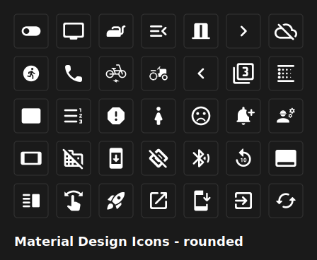


**sharp** (2,813 icons)


**twotone** (2,851 icons)


### Tabler Icons

**outline** (5,945 icons)


### Feather Icons

**all** (287 icons)

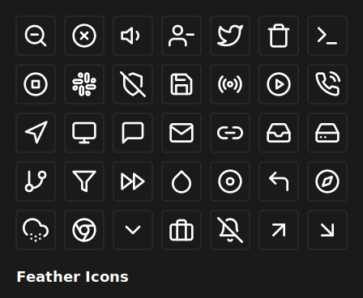


### Font Awesome

**brands** (549 icons)


**solid** (1,984 icons)

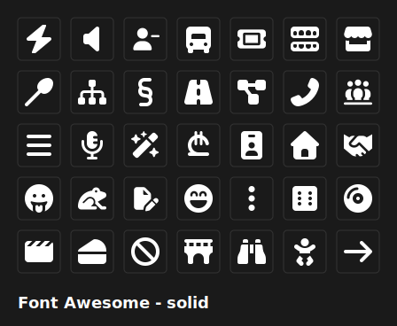


**regular** (273 icons)


### Icon Brew

**all** (758 icons)

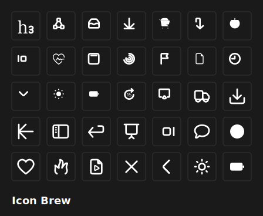


### RPG Awesome

**all** (495 icons)


### coolicons

**all** (442 icons)

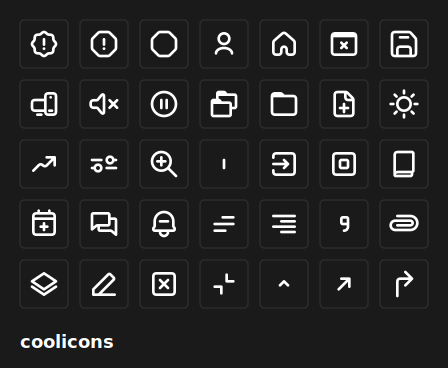


### Heroicons

**16-solid** (632 icons)


**20-solid** (648 icons)


**24-solid** (648 icons)

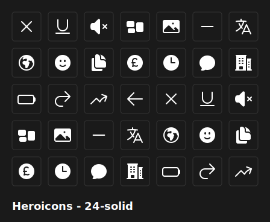


**24-outline** (648 icons)

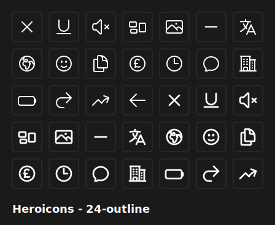


### Lucide Icons

**all** (1,635 icons)

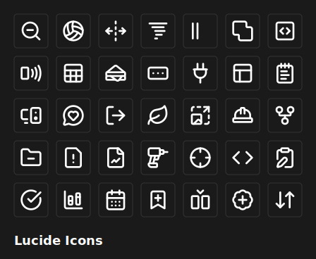


### Phosphor Icons

**bold** (1,512 icons)


**duotone** (1,512 icons)

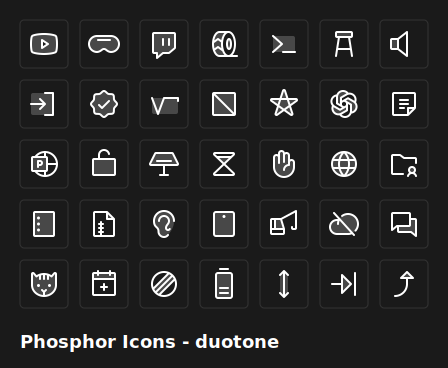


**fill** (1,512 icons)

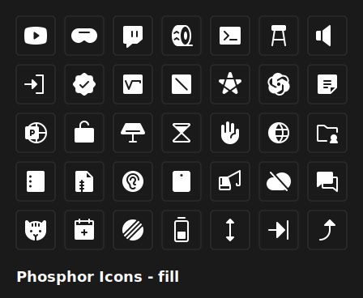


**light** (1,512 icons)

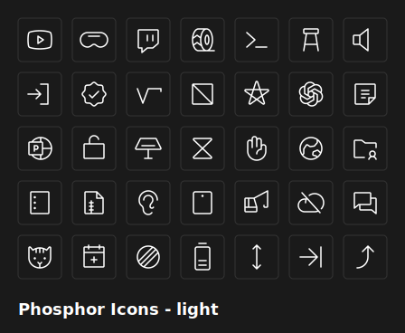


**regular** (1,512 icons)

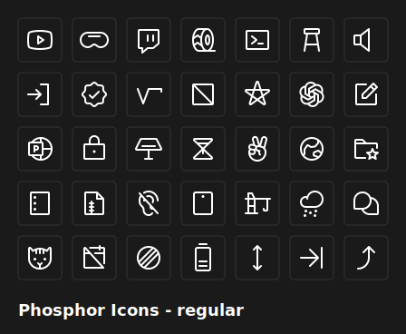


**thin** (1,512 icons)

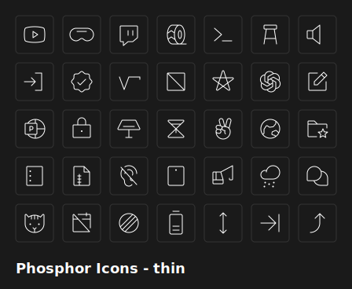


### Simple Icons

**all** (3,355 icons)

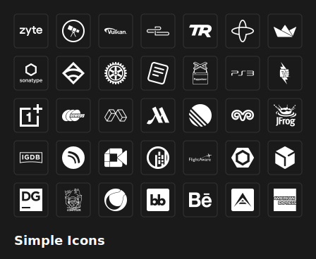


### Bootstrap Icons

**filled** (670 icons)

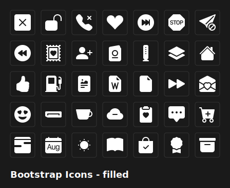


**unfilled** (1,373 icons)


**default** (35 icons)

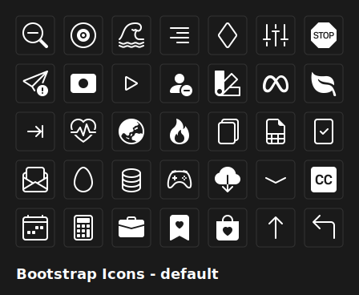


### Remix Icon

**default** (3,058 icons)

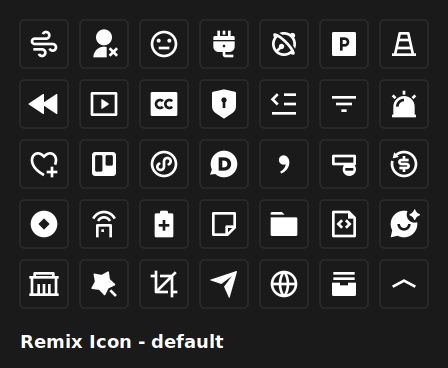


### Octicons

**default** (665 icons)

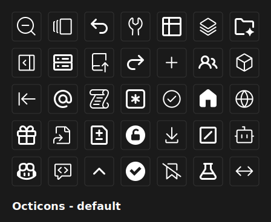


### Eva Icons

**fill** (246 icons)

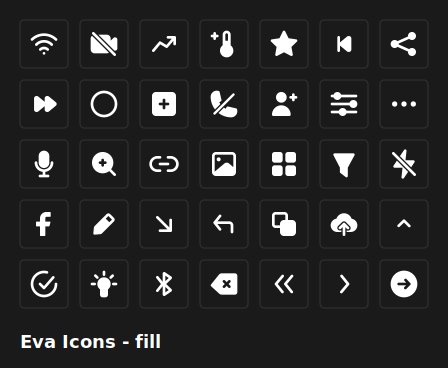


**outline** (244 icons)

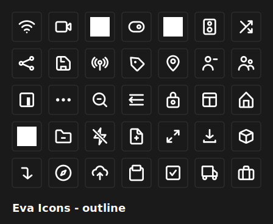


### Boxicons

**solid** (665 icons)

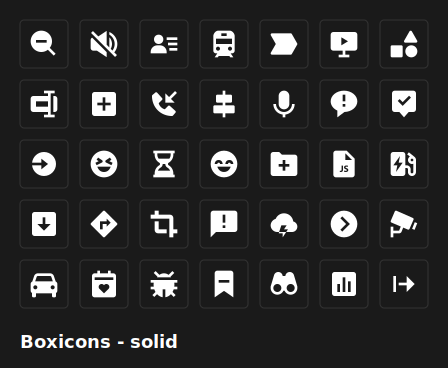


**regular** (814 icons)


**logos** (155 icons)


### CSS.gg

**all** (704 icons)

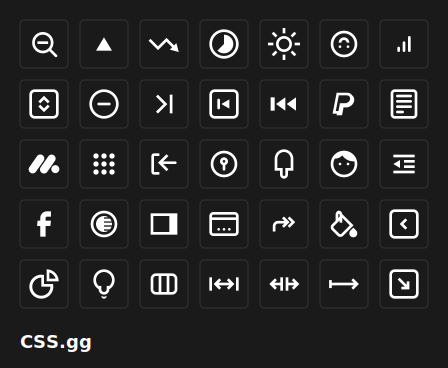


### Radix Icons

**all** (318 icons)


### Zondicons

**all** (297 icons)

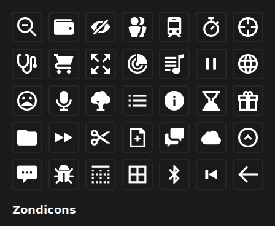


### System UIcons

**all** (430 icons)

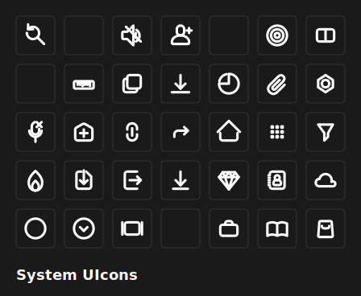


</details>


## 🔄 Automated Releases

This repository automatically creates a new GitHub release whenever changes are pushed to the main branch. Each release includes:
- All variant zip files as downloadable assets
- Automatic versioning based on date
- Complete changelog

## 📁 Repository Structure

```
├── README.md                 # This file
├── previews/                # Preview images for all icon packs
│   ├── bootstrap-icons-filled-preview.svg
│   ├── font-awesome-brands-preview.svg
│   └── ... (39+ preview images)
├── zips/                    # All icon pack zip files
│   ├── bootstrap-icons-filled.zip
│   ├── bootstrap-icons-unfilled.zip
│   └── ... (39+ variant zips)
└── svg-originals/           # Original SVG files with licenses
    ├── bootstrap-icons/
    ├── font-awesome/
    └── ... (20+ icon packs)
```

## 📄 Licenses

Each icon pack retains its original license. Check the `svg-originals/[pack-name]/LICENSE` file for specific licensing terms.

## 🤝 Contributing

This is an automated release repository. To contribute or report issues with the icon packs, please refer to the original repositories.

## ⚙️ GitHub Actions

This repository uses GitHub Actions to automatically create releases. The workflow:
1. Triggers on pushes to main branch
2. Generates a version number based on date
3. Creates a GitHub release
4. Uploads all zip files as release assets

To use this in your fork:
1. Fork this repository
2. Update the `[YOUR_USERNAME]` placeholders in README.md
3. Enable GitHub Actions in your fork
4. Push changes to trigger automatic releases
